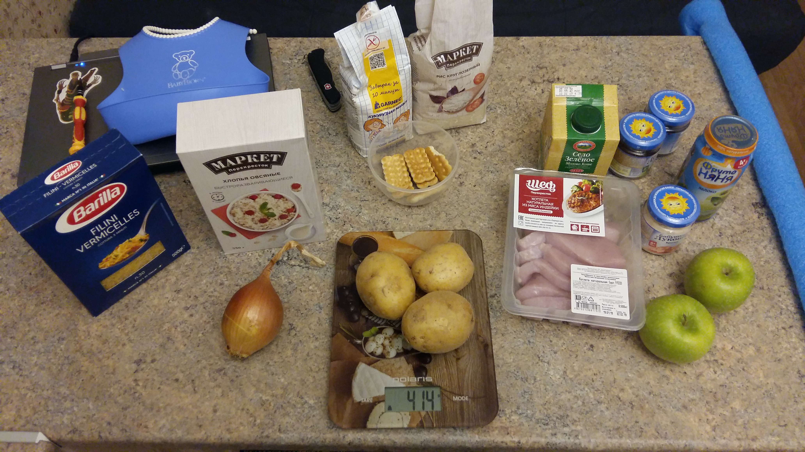

# Меню на один день

## Обзорное фото

## Завтрак

Каша овсяная (40 г) или рисовая (50 г) или кукурузная манка (30 г), 100 г молока, печенька, банка пюре. Пьет кипяченую воду с остатками пюре. Может съесть кусок яблока. Потом идет в сад.

## Обед

В саду первую половину дня, приходит на обед домой.
На обед суп из трети индейки (160 г), картошки (130 г), вермишели (60 г) половины луковицы (70 г) и морковки (100 г). Может попить молока, может воды, может у меня чай отобрать.

## Полдник

То же самое, что на завтрак.

## Ужин

Жареная картошка (260 г) с блендированным мясом от обеда, второй половиной луковицы (70 г), либо часть пасты, которую я варю себе (30 г) с банкой кролика. Может съесть большую банку пюре и доесть яблоки.

## Итого

Продукт               | Вес                        | Стоимость
----------------------|----------------------------|--------
Овсянка               |40 г 26,90 руб за 350 г     |3 рубля
Рис                   |50 г 87.90 руб за 900 г     |5 рублей
Кукурузная манка      |85 руб за 450 г             |6 рублей
Козье молоко          |500 мл                      |130 руб
Индейка               |180 руб за 500 г            |60 рублей
Кролик пюре           |1 банка                     |80 рублей
Картошка              |420 г                       |11 рублей
Лук                   |140 г                       |5 рублей
Яблоки                |300 г                       |27 рублей
Яблочное пюре         |1 банка                     |40 рублей
Черносливовое пюре    |2 банки                     |80 рублей
Печеньки              |25 г                        |5 рублей
Вермишель или паста   |100 г                       |12 рублей
Сумма                 |                            |464 рубля